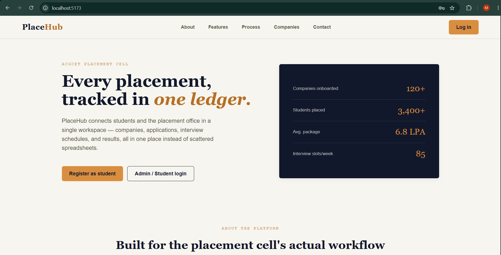
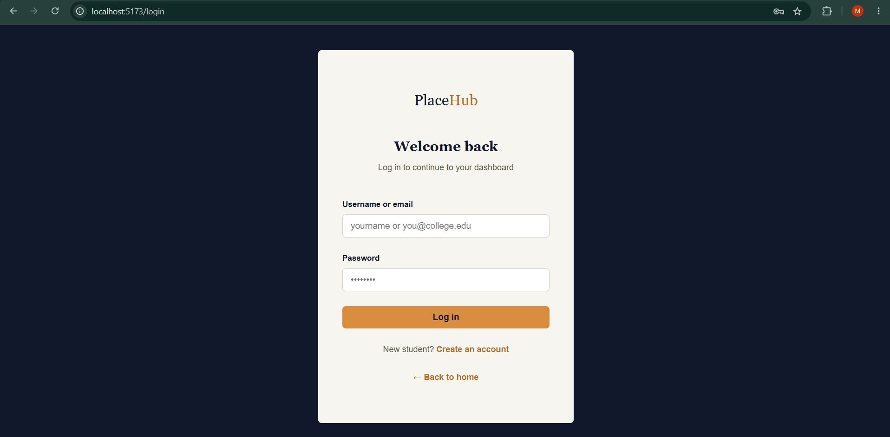
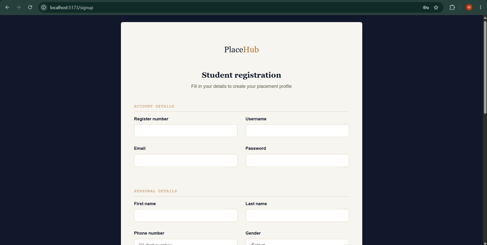
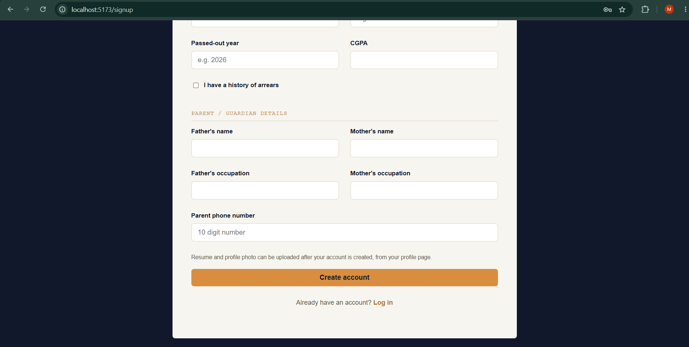
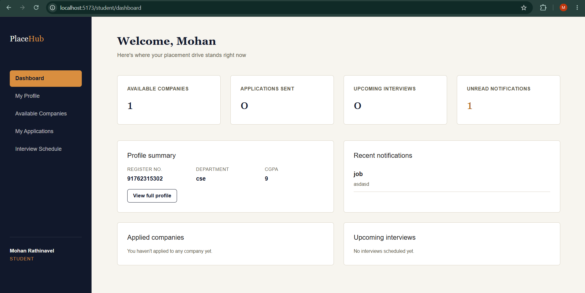
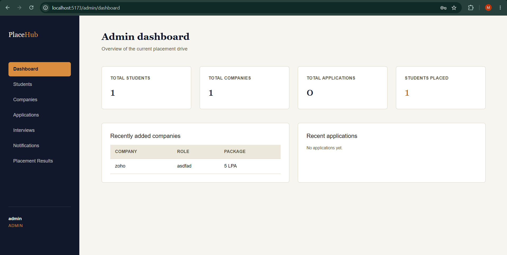

# PlaceHub — College Placement Management Platform

PlaceHub is a full-stack placement management system for a college placement cell. It has an admin side (manage students, companies, interviews, notifications, and results) and a student side (browse companies, apply, track applications, view interview schedules).


# 📸 Project Screenshots

## 🏠 Landing Page

<p align="center">
  
</p>

---

## 🔐 Login Page

<p align="center">
  
</p>

---

## 📝 Student Registration

### Registration Form - Part 1

<p align="center">
  
</p>

### Registration Form - Part 2

<p align="center">
  
</p>

---

## 👨‍🎓 Student Dashboard

<p align="center">
  
</p>

---

## 👨‍💼 Admin Dashboard

<p align="center">
  
</p>

## Tech stack

**Backend:** Java 17, Spring Boot 3, Spring Data JPA, Spring Security, JWT authentication, BCrypt password hashing, MySQL, Maven, Swagger/OpenAPI.

**Frontend:** React 18 with Vite, Axios, React Router, plain CSS (no framework).

## Project structure

```
placehub/
├── backend/      Spring Boot REST API
└── frontend/     React + Vite single-page app
```

## Prerequisites

- Java 17 or newer (`java -version`)
- Maven 3.8+ (`mvn -version`)
- Node.js 18+ and npm (`node -version`)
- MySQL 8.x running locally

## 1. Create the database

Open a MySQL client and run:

```sql
CREATE DATABASE placement_db;
```

That's it — Spring Boot will create all the tables automatically on first run (`spring.jpa.hibernate.ddl-auto=update`).

## 2. Configure the backend

Open `backend/src/main/resources/application.properties` and update these two lines with your own MySQL credentials:

```properties
spring.datasource.username=root
spring.datasource.password=your_mysql_password
```

Everything else (port, JWT secret, upload folder, Swagger paths) already has working defaults.

## 3. Run the backend

```bash
cd backend
mvn clean install
mvn spring-boot:run
```

The API starts on **http://localhost:8080**.

On first startup, a default admin account is automatically seeded into the database (see credentials below). You'll see a log line confirming this.

Swagger UI (interactive API docs) is available at:
**http://localhost:8080/swagger-ui.html**

## 4. Run the frontend

In a separate terminal:

```bash
cd frontend
npm install
npm run dev
```

The app starts on **http://localhost:5173** and talks to the backend at `http://localhost:8080/api`.

## 5. Log in

Go to **http://localhost:5173**, click **Log in** in the top-right corner, and use the seeded admin account below — or click **Create an account** to register as a student.

### Sample admin login

```
Username: admin
Password: Admin@123
```

(Email: `admin@placehub.com`)

Admins are redirected to `/admin/dashboard`, students to `/student/dashboard`, automatically based on role.

## Backend modules

| Module | Description |
|---|---|
| Authentication | Login, student signup, JWT issuing, `/api/auth/me` |
| Admin | Dashboard summary, student CRUD |
| Student | Profile, resume/photo upload, convenience endpoints for companies/applications/interviews/notifications |
| Company | Add/update/delete/list companies, filter by type |
| Placement Application | Apply, list by student/admin, update status, eligibility checks (CGPA, department, arrears), duplicate-application prevention |
| Interview Schedule | Schedule, update, delete, list by student/admin |
| Notification | Send to all students or a specific student, mark as read |
| Placement Result | Record final placement outcome, list all, lookup by register number |
| AI placeholder | Stub endpoints for future resume analysis, company matching, skill-gap analysis |

## Frontend pages

| Route | Page |
|---|---|
| `/` | Landing page |
| `/login` | Login |
| `/signup` | Student signup |
| `/admin/dashboard` | Admin dashboard |
| `/admin/students` | Manage students |
| `/admin/companies` | Manage companies |
| `/admin/companies/add` | Add company |
| `/admin/applications` | Applications |
| `/admin/interviews` | Interview schedule |
| `/admin/notifications` | Notifications |
| `/admin/results` | Placement results |
| `/student/dashboard` | Student dashboard |
| `/student/profile` | Student profile |
| `/student/companies` | Available companies |
| `/student/applications` | Student applications |
| `/student/interviews` | Student interviews |

Admin routes are only reachable by users with the `ADMIN` role; student routes only by `STUDENT`. This is enforced both in the frontend (`ProtectedRoute`) and the backend (`SecurityConfig` + `@PreAuthorize`).


## Security notes

- Passwords are hashed with BCrypt before storage — never stored in plain text.
- JWT tokens are issued on login/signup and must be sent as `Authorization: Bearer <token>` on every protected request. The frontend's Axios instance (`src/api/api.js`) attaches this automatically.
- Public (no-auth) endpoints: `POST /api/auth/login`, `POST /api/auth/student/signup`, and the Swagger UI.
- Everything else requires a valid JWT, and role-specific endpoints additionally check the user's role.

## Troubleshooting

**Backend won't start / "Access denied for user" from MySQL** — double-check the username/password in `application.properties` matches a real MySQL user with privileges on `placement_db`.

**Frontend shows network errors** — make sure the backend is running on port 8080 before loading the frontend; the dashboards fetch live data immediately on page load.

**"User not found. Please signup."** on login — this means no account exists with that username/email yet. Use the signup page, or log in with the seeded admin account.

**File uploads (resume/photo) not appearing** — uploaded files are served from `/uploads/**`, written to `backend/src/main/resources/static/uploads/`. Make sure the backend process has write permission to that folder.
